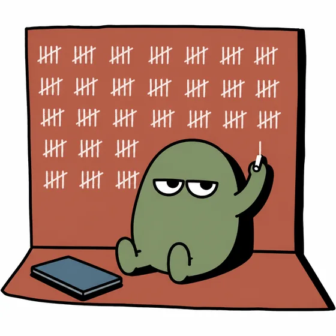
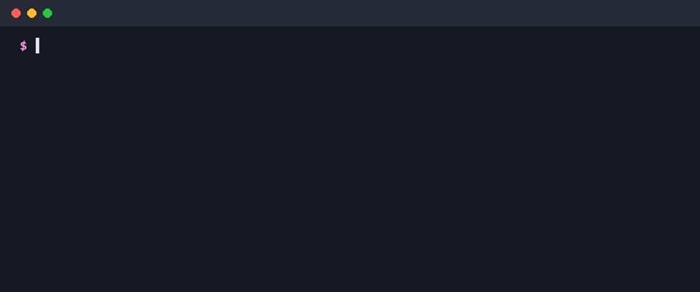
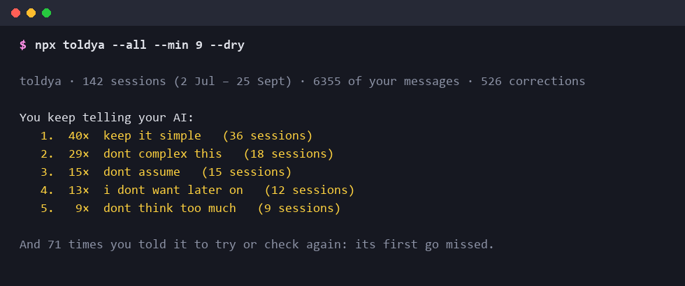
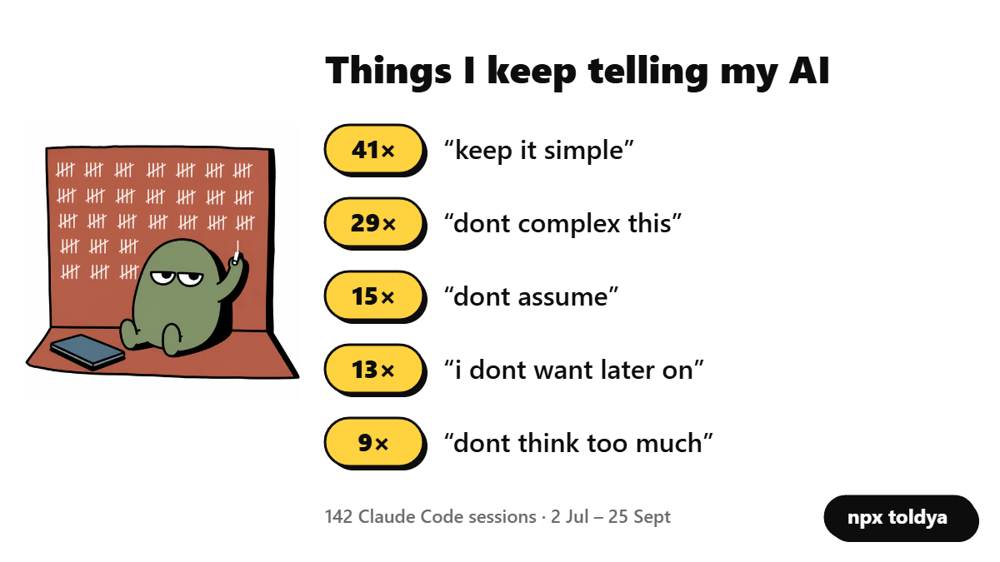

<p align="center"></p>

<h1 align="center">toldya</h1>

<p align="center"><b>Stop repeating yourself to your AI.</b></p>

<p align="center">Part of <a href="https://singhlabs.dev/toldya/">Singh Labs</a>, small tools for people who code with AI.</p>

<p align="center">
  <a href="https://www.npmjs.com/package/toldya"></a>
  
  
  <a href="LICENSE"></a>
</p>

<p align="center"></p>

```bash
npx toldya --all
```

You keep telling your coding agent the same things. "Keep it simple." "Don't assume."
"Don't complicate it." toldya reads what you typed to Claude Code, finds what you keep
repeating, and writes it into the rule file your agent reads, with your yes. Next time,
it counts whether you still had to say it.

## What it found on the author's own history

A real run. Not a mock-up.

<p align="center"></p>

142 sessions. "Keep it simple" 40 times. Rewordings and typos count as one habit: "Don't
complicate it" and "dont complex this" are the same thing said twice.

## Use it

```bash
npx toldya                  # this project: offers rules for ./CLAUDE.md
npx toldya --all            # every project: offers rules for ~/.claude/CLAUDE.md
npx toldya --dry            # report only, change nothing
npx toldya --to AGENTS.md   # write rules somewhere else
npx toldya --add 1,3        # take repeats 1 and 3 without the prompts
npx toldya --min 5          # only things you said 5+ times
npx toldya --json           # machine-readable report
npx toldya --card           # an image of your top repeats, to share
```

Without `--dry` or `--add`, it asks about each repeat: **y** adds it, **n** skips it,
**e** lets you reword it first. Rules go under a `## Things I kept repeating` heading.
Nothing is written without a yes.

Run it again a week later and every rule it added shows how often you said it before,
and how often since.

## Share it

`npx toldya --all --card` opens your card in the browser. One click saves it as a PNG.
It's drawn on your machine; nothing is uploaded.

<p align="center"></p>

## What it reads, and what it doesn't

- Only **your own messages** in Claude Code's history on this machine (`~/.claude/projects`).
  Not the AI's replies, not tool output, not your files.
- Long messages are treated as pastes (briefs, logs) and skipped. Questions and "I don't
  understand" are not corrections, so they're skipped too.
- A repeat counts only if it shows up in **at least two sessions**.
- Short "try again" / "check again" messages are counted separately. They mean the first
  attempt missed, but they aren't rules you can write down.
- **Sends nothing anywhere.** No account, no telemetry, no network calls.

Claude Code keeps about 30 days of history by default, so on a default install toldya sees
roughly a month.

## Coming next

- **Team mode:** `npx toldya owner/repo` reads a repo's pull-request review comments (from
  people or any review bot), finds what reviewers keep writing, and opens one PR into `AGENTS.md`.
- Codex history (not tested on real files yet, so not claimed).

## Requirements

Node 18+. No dependencies.

## License

MIT © Sevenopt Solutions Private Limited · made by [Singh Labs](https://singhlabs.dev)
